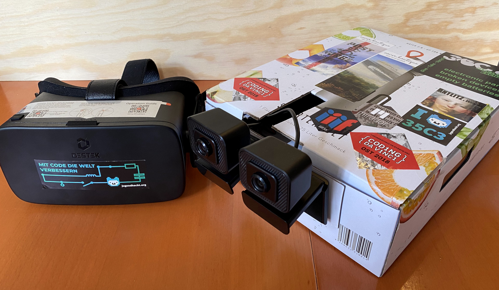
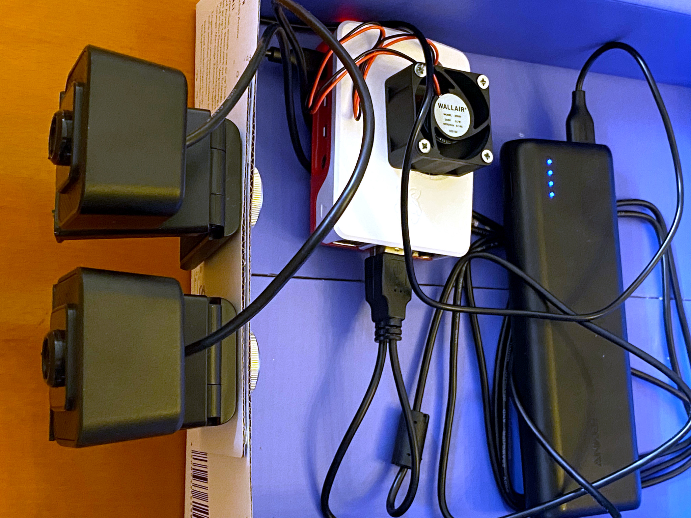
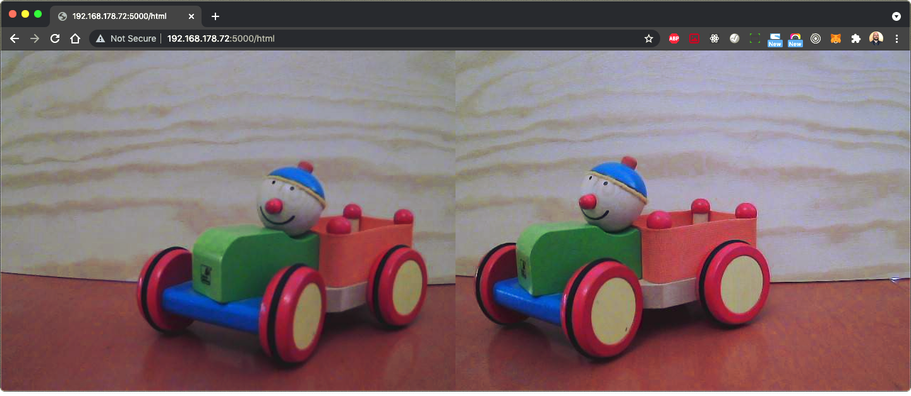
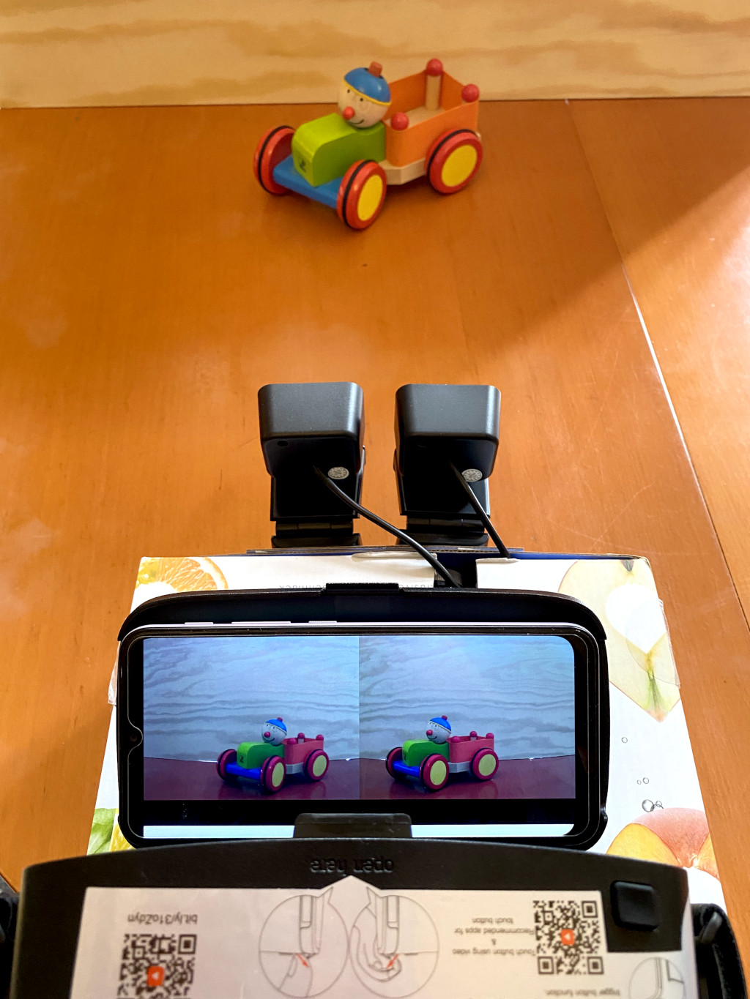

# DIY Stereo Camera

A quick Sunday project: build a quick and dirty stereo camera.



## Material
- a Raspberry Pi (I used Model 4 / 4GB plus an additional Fan)
- Two Cheap USB Webcams
- an old cardboard box
- a Powerbank
- one of those cheap plastic VR head mount frames for your phone

Build it all together:



## Install necessary Software

```
sudo apt-get install python python-opencv python-flask build-essential libssl-dev
```

## Run it

Clone this repo

```
git@github.com:leanderseige/stereocam.git
```
and run the server
```
flask run --host=0.0.0.0
```
Now check with your browser and your phone's browser (should be on the same WLAN).



Put the phone in the VR frame and enjoy!


